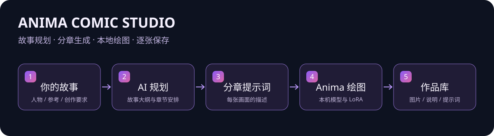
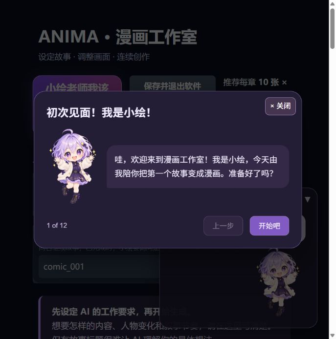

# Anima Comic Studio

**Turn a story idea into a sequence of comic illustrations.**

Local Windows rendering · Chapter-based planning · Model & LoRA management · Guided onboarding

[中文介绍](README.md) · [Downloads](docs/DOWNLOADS.md)

Anima Comic Studio connects story planning through an AI API with local Anima / ComfyUI image generation. Describe your story, characters and creative direction; the application plans chapters, prepares frame prompts, renders locally and saves each image as it finishes.

The full Windows package includes the engine, Python runtime, plugins and bundled models. The interface opens in a browser while the application runs on your computer. The current interface and tutorial are primarily in Chinese.

> Documentation for **v1.2.6**. The Offline package bundles local dependencies. AI story planning still requires a network connection and your own API account.

## Features

| Feature | What it does |
| --- | --- |
| Chapter-based creation | Plans an outline and generates frame prompts chapter by chapter, up to 500 images per project. |
| Creative direction | Editable instructions for pacing, relationships, visual style and storytelling. |
| Character inputs | Separate fields for lead and supporting characters. |
| Optional references | Action, clothing, setting, style and camera references, including UTF-8 text imports. |
| Rendering controls | Resolution, steps, CFG, sampler, scheduler, denoise and seed. |
| Fixed prompt prefix | LoRA trigger words and recurring prompt terms through quality_prefix. |
| Model library | Compatible checkpoint selection, multiple LoRAs and adjustable strengths. |
| Author information | Civitai metadata, author links, preview images and model-card cover selection. |
| Immediate saving | Saves each finished image without waiting for the whole story. |
| Optional captions | Adds a Chinese caption band through local text layout, or saves the picture alone. |
| Work library | Images, captions, prompts, outline and quick frame navigation. |
| Persistent settings | Restores previous editing settings and model configuration. |

Continuity, character consistency and complex interactions are goals of the workflow, not guaranteed outcomes. Results depend on model capability, references and generation settings.

## Meet Xiaohui

<table><tr><td></td><td></td></tr></table>

Xiaohui introduces important controls, explains missing basic inputs and reports the current creation stage. Her drawing animation uses two transparent frames. A progress bar is shown during individual-image sampling; planning stages use status text.

## First run: try 10 images

1. Download the full release and extract it completely.
2. Run **启动软件.cmd**. A separate ComfyUI installation is not required.
3. Open the Xiaohui tutorial using the prominent button at the top.
4. Enter your own API key. DeepSeek users can [create a key](https://platform.deepseek.com/api_keys) and [check usage](https://platform.deepseek.com/usage).
5. Fill in creative instructions, story and character information.
6. Set **10 images per chapter × 1 chapter = 10 images**.
7. Start generation and inspect the results in the work library.

Increase the length after validating your settings. Ten images across ten chapters produces 100 images, not ten.

The bundle targets compatible Windows and NVIDIA GPU environments. VRAM needs depend on models, resolution and LoRAs; a universal tested minimum is not claimed. Allow disk space for extraction, caches and generated work.

## Files and privacy

| Content | Location relative to the software folder |
| --- | --- |
| Current settings, overwritten in place | user_data/current_draft.json |
| API key protected with Windows encryption | user_data/api_key.dpapi |
| Saved project settings | projects/ |
| Images, outline and diagnostics | engine/output/anima_long/ |
| Models | engine/models/ |

Story and reference text are sent to the configured AI service. Rendering happens locally. Civitai metadata queries send a model-file hash to Civitai. Do not publish personal settings, keys, projects or logs with a release.

## Update and exit

Existing users can use the smaller update archive. Exit the application, extract it into the existing folder containing 启动软件.cmd, runtime and engine, and replace program files. Preserve user_data, projects, models and outputs.

Use **保存并退出软件** (Save and exit) for explicit shutdown. Closing the final browser connection also schedules shutdown after a reconnection grace period of approximately 30 seconds; disconnect detection may add delay. Unfinished generation stops, while completed images remain saved.

## Current scope

- The packaged release targets Windows; verified macOS/Linux bundles are not included.
- Models must be compatible with the Anima workflow.
- API availability, latency and cost depend on the provider and network.
- API LoRA uploading, fine-tuning and an adaptive example library are not implemented features.
- Windows process-tree shutdown was not fully exercised in the restricted development environment. Feedback from different machines is welcome.

## v1.2.6

- Transparent-background repair for both drawing frames and updated image cache version.
- Includes the caption switch, automatic settings persistence and revised save-control placement.
- Includes the top-level save-and-exit control and last-browser-session shutdown handling.

## Feedback and credits

When opening an Issue, include the version, GPU/VRAM, reproduction steps and redacted error logs. Never include your API key.

Thanks to [ComfyUI](https://github.com/Comfy-Org/ComfyUI), [Gradio](https://github.com/gradio-app/gradio), [Anima / CircleStone Labs](https://huggingface.co/circlestone-labs/Anima), plugin authors and model creators.

Components retain their own licenses. Some models have non-commercial terms. This bundle does not grant unrestricted commercial rights or represent an official release endorsed by those authors. Preserve [NOTICE.txt](NOTICE.txt), [licenses](licenses/) and component notices when redistributing.
