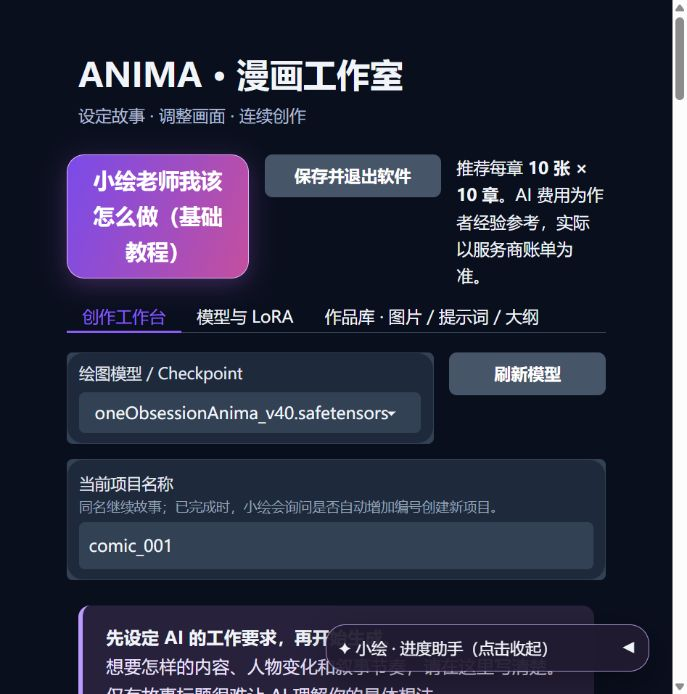
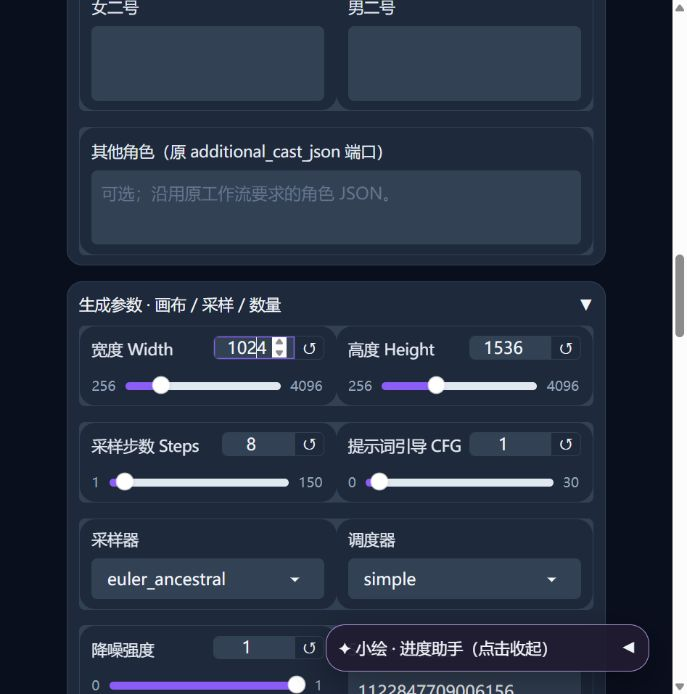
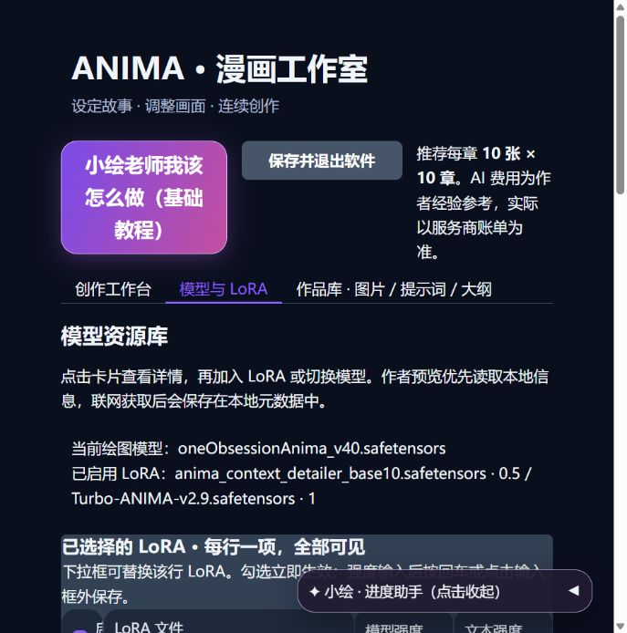

<div align="center">

# Anima Comic Studio · 漫画工作室

**把一个故事，变成可以连续创作的漫画画面。**

Windows 本地绘图 · AI 分章规划 · 模型与 LoRA 管理 · 小绘陪伴式教程

[快速开始](#快速开始) · [主要功能](#主要功能) · [下载说明](docs/DOWNLOADS.md) · [English](README.en.md)

</div>


Anima Comic Studio 是一个面向长篇漫画创作的本地工作室。你提供故事、人物与创作要求，AI 负责规划章节和生成画面提示词，再由本机的 Anima / ComfyUI 工作流逐张绘图、保存结果。

完整 Windows 包已包含绘图引擎、Python 运行环境、配套插件与模型，无需另外搭建 ComfyUI。界面在浏览器中打开，绘图程序运行在自己的电脑上。

> **当前介绍对应 v1.2.6。**“离线完整包”指本地运行组件随包提供；AI 故事规划仍需要联网调用 API，并使用你自己的账号和密钥。

## 先看界面

<table>
<tr><th>创作工作台</th><th>小绘基础教程</th></tr>
<tr>
<td></td>
<td></td>
</tr>
</table>

*截图来自不含个人数据的演示项目；界面会随窗口宽度调整排版。*

## 主要功能

### 1. 从故事主线到分章画面

填写一句故事主线，或者一段更完整的梗概，再用 **AI 工作设定**告诉 AI 你想怎样讲这个故事：人物关系、事件发展、节奏、镜头和画面风格都可以在这里说明。

- 先规划整体故事，再分章节生成画面提示词。
- 以章节组织较长任务，不需要一次让 AI 写完全部画面。
- 支持每章张数与章节数设置，**总张数 = 每章张数 × 章节数，上限 500 张**。
- 提示词设计关注相邻画面的因果关系、当前人物状态与瞬间动作。
- 同一项目可继续创作；项目完成后提供增加编号、创建新项目的提示。

故事连续性、角色一致性和构图效果仍受 AI 输出、绘图模型及参考信息影响。建议先做小规模试画，再扩展成长篇。

### 2. 创作要求自己掌握

**AI 工作设定放在创作台前面，因为它决定 AI 怎样完成工作。**

预设使用中文，可以直接修改。只填故事名字时，AI 会自行补充许多细节；如果你对事件、人物变化、画面节奏有明确要求，请在这里写清楚。

例如：

```text
创作一部温暖的小镇生活漫画。主角第一次举办画展，朋友帮助她准备。
用准备、遇到困难、共同解决、开幕四个阶段展开。
重要事件要有开始、过程和结果，每张只描写一个能画出的瞬间。
人物基础外貌保持一致，同一场景内服装连续。
镜头根据情节变化，兼顾环境、人物互动和表情特写。
```

人物设定、故事主线和 AI 工作设定分别填写，后续调整更方便。

### 3. 多角色与可选参考资料

女主、男主、女二号、男二号有各自的输入区，也保留其他角色入口。将名字、发色、瞳色等身份特征分开写，便于 AI 区分角色。

动作、服装、场景、画风、镜头和其他参考均可按需提供，也可以留空。支持导入 UTF-8 文本。

“参考获取（热门角色提示词获取）”可跳转到 [Animadex](https://animadex.net/?mode=characters)。外部站点内容由其提供方维护。

### 4. 绘图参数集中调整

在同一组设置中调整画布宽高、Steps、CFG、采样器、调度器、降噪强度和 Seed。`Seed = -1` 表示随机。

**LoRA 触发词 / quality_prefix** 用于每张画面固定加入的内容：可以填写模型作者要求的触发词，也可以填写希望持续保留的风格提示。

<details>
<summary>查看绘图参数界面</summary>



</details>

### 5. 模型与 LoRA 独立管理

- 创作台顶部直接选择绘图模型。
- “模型与 LoRA”页面集中管理绘图模型、LoRA、文本编码器和 VAE。
- 已选择的 LoRA 逐行显示，支持启停、替换、移除与强度调整。
- 从本地 LoRA 列表搜索并添加，不必回到复杂的节点图里修改。
- 显示模型存放目录，并提供打开目录、导入与刷新入口。
- 支持查询 Civitai 信息、查看作者页面、示例图及触发词。
- 点击作者示例图，可以将其设为模型卡片封面。

**添加的模型需要兼容当前 Anima 工作流。**并非任意 SD 模型都可以直接替换。联网信息和作者预览需要外部站点可访问，封面选择会保存在本机。

<details>
<summary>查看 LoRA 设置界面</summary>



</details>

### 6. 每生成一张，就保存一张

结果逐张写入本地，无需等整部长篇完成才拿到图片。

生成按钮附近的 **“是否生成描述”** 控制图片底部的中文说明：

| 选择 | 保存结果 |
| --- | --- |
| 开启 | 图片底部添加 caption 说明 |
| 关闭 | 仅保存画面，不添加底部文字 |

文字由本地程序排版，不需要让绘图模型把中文字画出来。开关影响后续生成，不会自动改写已经保存的图片。

作品库支持浏览图片、查看对应中文说明与完整提示词、查看故事大纲，并通过缩略图滚动条和序号滑块快速定位。

### 7. 小绘老师陪你开工


点击 **“小绘老师我该怎么做（基础教程）”**，跟随提示框认识重要设置。

- 初次见面、再次教学、思考、绘画、完成和出错有不同表情。
- 悬浮助手可以收起，不占用主内容排版。
- 显示正在规划故事、准备章节提示词或生成图片等阶段。
- **只有单张图片采样时显示步数进度条**，其他阶段显示文字说明。
- 缺少 API Key 等基础输入时，引导你回到相应设置。
- 绘图时使用两帧透明差分表现画画动作。

<br clear="all"/>

### 8. 记住上次的设置

故事、人物、参数、模型和 LoRA 组合等编辑内容自动保存到本机固定记录中，覆盖更新，不会每次新建一份历史副本。

API Key 单独通过 Windows 加密机制保存在本机，不写入公开工作流。更新时保留 `user_data` 与 `projects`，即可延续自己的创作环境。

页面顶部提供 **“保存并退出软件”**。关闭最后一个网页连接后也有延迟退出逻辑；短时间刷新或重连可取消退出。推荐使用退出按钮，明确保存设置并停止引擎。

## 快速开始

### 运行前准备

- 与随包运行时兼容的 **Windows + NVIDIA GPU** 环境。
- 为解压后的程序、模型、缓存及生成图片预留足够磁盘空间。
- 可用的 AI API 账号、密钥与网络连接。

显存需求随模型、分辨率和 LoRA 组合变化。目前没有覆盖所有硬件配置的统一最低显存结论；首次使用先保留预设参数进行少量测试。

### 第一次先生成 10 张

1. 从本项目发布页下载**完整包**，完整解压。
2. 双击 **`启动软件.cmd`**，等待浏览器打开本地界面。
3. 点击小绘基础教程，认识 AI 工作设定、人物、参数和 API 设置。
4. 填写自己的 API Key。DeepSeek 用户可前往 [创建密钥](https://platform.deepseek.com/api_keys)，在 [用量页面](https://platform.deepseek.com/usage) 查看账户情况。
5. 填写 AI 工作设定与故事主线，按需补充人物信息。
6. 设置 **每章 10 张 × 1 章 = 10 张**。确认需要的 LoRA 触发词及“是否生成描述”开关。
7. 点击 **“开始生成 / 继续故事”**，完成后到作品库查看结果。

测试满意后，可以尝试 **10 张 × 10 章 = 100 张**，再逐步增加。10 × 10 是 100 张，不是 10 张测试。

## 文件保存在哪里？

| 内容 | 相对软件目录的位置 |
| --- | --- |
| 当前编辑设置 | `user_data/current_draft.json` |
| 本机加密的 API Key | `user_data/api_key.dpapi` |
| 已运行项目的设置 | `projects/` |
| 图片、故事大纲与诊断信息 | `engine/output/anima_long/<项目名>/` |
| 模型文件 | `engine/models/` |
| 启动与引擎日志 | `logs/` |

故事和参考内容会随任务发送给配置的 AI 服务商；绘图在本机进行。Civitai 信息查询会向该站发送模型文件哈希。对外分享时请使用干净的发布包，不要附带自己的 `user_data`、项目、日志或作品目录。

## 下载与更新

完整包包含本地运行组件及配套模型；更新包用于已经安装的用户，体积更小，不需要重复下载模型。

更新前先退出软件，将更新包内容覆盖到含 `启动软件.cmd`、`runtime` 和 `engine` 的原目录，再重新启动。**不要先删除原目录。**

具体文件名、更新方式与校验说明见 [下载说明](docs/DOWNLOADS.md)。

## 常见问题

**这是在线网站吗？**  
界面在浏览器里显示，但服务运行在本机。`127.0.0.1` 是本机地址。故事规划的 API 调用则需要联网。

**是否需要另外安装 ComfyUI？**  
使用完整包不需要。运行库检查会在启动时进行。

**能保证角色始终一致吗？**  
不能保证。系统通过角色信息、状态记录与提示词组织帮助维持连续性，最终仍受模型能力影响。复杂多人互动和第一人称尤其建议先小批量验证。

**生成中断后怎么办？**  
已保存图片仍在。保留原项目名和项目文件，排除服务或模型问题后尝试继续。不要为了重试直接删除项目。修改关键故事配置可能影响续跑。

**费用是多少？**  
AI API 按服务商账单计费，本地绘图另有硬件与电力成本。作者以往使用经验约为每 100 张 ¥0.6–1 的 AI 调用费，仅作参考，不是固定报价或费用保证。

**为什么没有放我自己的 API Key？**  
发布包不含作者或其他用户的密钥，每位用户使用自己的账号。

## 当前范围与已知限制

- 当前交付面向 Windows；未提供经过验证的 macOS、Linux 整合包。
- 模型和 LoRA 需与工作流兼容；增加资源可能提高显存占用。
- API 可用性、速度与费用取决于服务商和网络。
- 当前版本没有“上传 LoRA 到 DeepSeek API”或自动训练 AI 的功能；案例库增强方案仍处于讨论阶段。
- 退出流程已加入进程树清理；开发验证环境限制了该 Windows 操作的完整实测，欢迎反馈不同机器上的表现。

## v1.2.6 更新要点

- 修复小绘画画差分的黑色背景，两帧统一为透明图片。
- 更新图片资源版本，减少浏览器旧缓存影响。
- 包含“是否生成描述”开关、设置自动保存和保存栏布局调整。
- 包含顶部保存退出按钮与关闭最后一个网页后的退出逻辑。

## 反馈与致谢

遇到问题，请通过本项目 **Issues** 提供软件版本、显卡与显存、复现步骤、报错节点及经过脱敏的日志。不要上传 API Key 或完整个人设置文件。

感谢 [ComfyUI](https://github.com/Comfy-Org/ComfyUI)、[Gradio](https://github.com/gradio-app/gradio)、[Anima / CircleStone Labs](https://huggingface.co/circlestone-labs/Anima) 及相关插件和模型作者。

随包模型包括 One obsession_Anima（maxfeifei8）、Anima Detail Tweaker（lse14）和 TURBO for ANIMA（n_Arno）等资源；作者链接及已收集的许可信息见 [NOTICE](NOTICE.txt) 与 [licenses](licenses/)。

**本项目整合包不代表所有组件都采用同一种开源或商业许可。**模型包含非商业许可条款，使用及再分发请保留各组件署名与许可，并遵循其具体条件。此项目不是上述作者的官方发行版。
